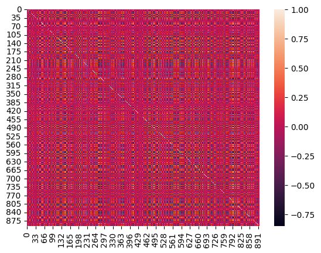
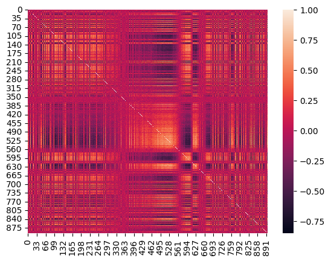
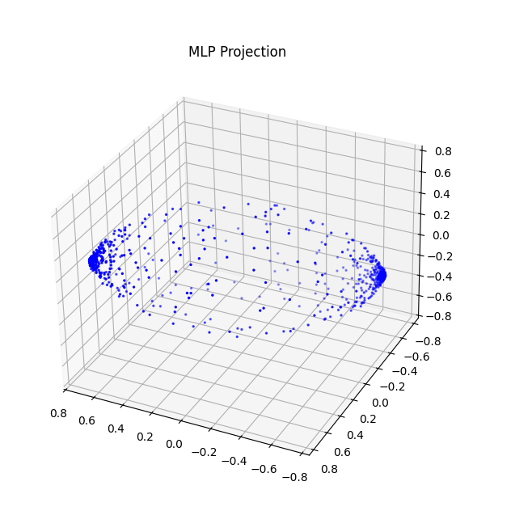
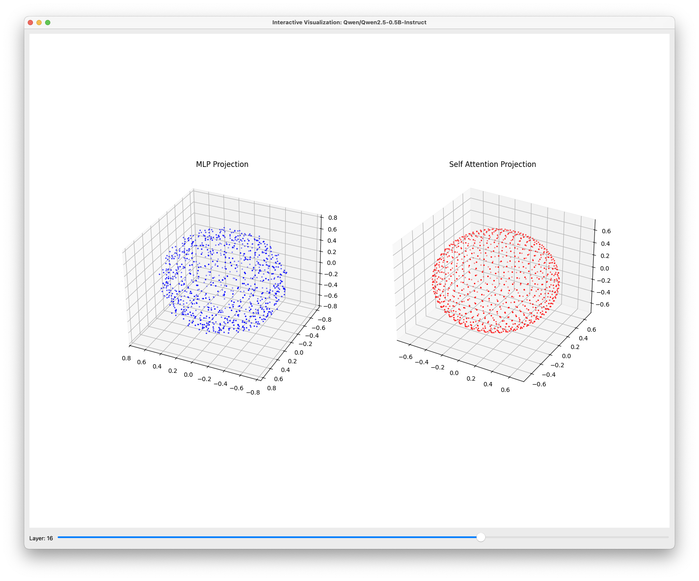
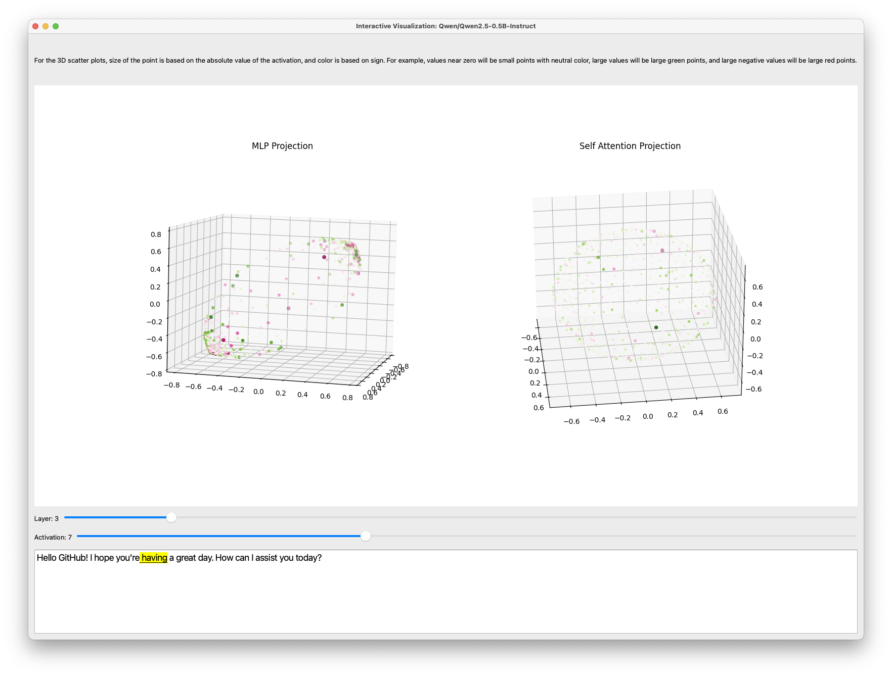

# Transformer Projector

Table of Contents:
  
Hi! In this repo, I investigated projecting layers of neurons into higher dimensional spaces, and seeing the kinds of structures they form when organized by activation correlations.

I hope you find this exploration interesting and perhaps even useful for your own work. Please take these findings with a grain of salt – I'm not an expert in this field, just a curious individual working through an interesting problem that caught my attention.

If you have any questions, insights, or want to discuss this project further, feel free to reach out at [meet.s.patel.nj@gmail.com](mailto:meet.s.patel.nj@gmail.com).

## Table of Contents:
  - [Worklog](#worklog)
    - [Initial Thoughts](#initial-thoughts)
    - [Permutations](#permutations)
    - [Linear Positions](#linear-positions)
    - [Generalized Projections](#generalized-projections)
  - [This Repo](#this-repo)
    - [App](#app)
  - [Future Thoughts](#future-thoughts)

## Worklog

### Initial Thoughts

This project came about because I was curious as to if you could "reorder" the neurons in a dense layer such that closeby neurons would have a higher correlation to each other. There is an adage in neuroscience of "neurons that fire together, wire together"; while this is more applicable to inter-layer connections, I was wondering if there was anything to be learned from applying this to intra-layer positions. And if anything, the charts you could make with a "sorted" set of neurons would be much prettier than an unsorted set, which looks like random noise.

The following is a correlation heatmap of a typical dense layer.

After "sorting" (method will be described below), the same layer with the same input looks like this:

As you can see, there is a lot more structure now (and much prettier to look at).

Eventually, I expanded the goal of "reordering" to "projecting", as it is more generalizable and may potentially help accomplish a secondary goal: pruning. But I'll talk about this later in the report.

### Permutations

My initial hope to "sort" the neurons by activation correlations had a pretty straight forward goal: given a set of neurons and a correlation matrix (based on activations of those neurons over a dataset), generate a reordering of the neurons that places high correlation neurons near each other and anticorrelated neurons far apart.

In this method, I'd start with a vector (call it the "order vector") $\vec{O} \coloneqq [0, 1, 2, ..., N-1], O_i \in \mathbb{N}$, ($N$ is the number of neurons in the layer) to hold the sorted order. $O_i$ would represent the index of the $i$-th neuron in the sorted order. Given a correlation matrix $\pmb{\rho}$ over the entire dataset, somehow generate a permutation matrix $\mathbf{P}$ such that the vector-matrix product, $\vec{O}' = \vec{O}\mathbf{P}$, would yield a new ordering of the neurons (each number from $0$ to $N-1$ would appear exactly once in the resulting vector). This raises the question of how to create a permutation matrix from a correlation matrix.

But, the more pressing matter is: to do this method would require computing the correlation matrix of the activations over an *entire* dataset. For a sufficiently large dataset (which would be needed, as you want to explore as diverse of a topic set as possible), you would have to keep track of the activations on each layer of interest for each batch of the dataset. Not only that, you would need to calculate the correlation of the resulting activations matrix, which would be **huge**. This is infeasible. Much like gradient descent has mini-batch gradient descent, this method needs a batched version to slowly reorder the neurons as a series of updates.

If we want a batched version, we would have to use multiple permutation matrices $\{\mathbf{P_0}, \mathbf{P_1}, \dots\}$ generated from multiple correlation matrices $\{\pmb{\rho}_0, \pmb{\rho}_1, \dots\}$ to iteratively compute the new ordering: ${\vec{O'}} = \vec{O}\mathbf{P_0} \mathbf{P_1}\cdots$. However, after some thinking, I scrapped this idea of permutation matrices. It seemed like a pain to think through how to represent creating natural-number valued permutation matrices from continuous valued correlation matrices. I wanted to think of a continuous approach based on a loss-function to this problem.

### Linear Positions

Still sticking with the case where I am "reordering" neurons, I thought of a work around to my permutation matrix problem. Instead of trying to permute position indexes (which have to be natural numbers), instead:

1. Project each neuron onto a real number in some interval using even spacing (`linspace` comes in handy here). Call this vector, the projection vector: $\mathbf{p}$. The interval I chose was $[0, \sqrt{N}]$, but this is quite arbitrary. I chose this interval for two reasons:
    - It is large enough that I won't run into precision issues with `fp32`; or rather, I wouldn't spook myself out over precision loss. Imagine the case where you have a very wide network (i.e. $N$ is large). Fitting $N$ points into $[0, 1]$, and then calculating gradient updates on these positions made me worried about precision loss on `fp32`. I know this probably wouldn't affect my outcome much, if at all. Just better to be safe than sorry, as debugging this would have been a nightmare.
    - It's not too large, like $[0, N]$, such that I get a heart attack when looking at the initial loss values. (Trust me, I tried this. That whole bit about the heart attack was no joke.)

2. Given a correlation matrix over a batch $\pmb{\rho}$, convert into a "cost-contribution" matrix by $\mathbf{C} \coloneqq -0.5 \pmb{\rho} + 0.5$. This maps the range of correlations $[-1, 1]$, where larger is better to $[0, 1]$, where smaller is better.

3. Construct a matrix $\mathbf{D}$, called the "distance" matrix such that $\mathbf{D}_{ij} \coloneqq | \mathbf{p}_i - \mathbf{p}_j |$.
4. Compute the Hadamard product $\mathbf{D} \otimes \mathbf{C}$, and sum all the values together into a single number. (Since both $\mathbf{D}$ and $\mathbf{C}$ are symmetric, this resulting matrix will also be symmetric. So, you can get away with summing just one triangle of the resulting matrix.) This is your loss value.
5. Now that you can construct a loss value given a positions vector $\mathbf{p}$, run optimization over your dataset to get the values of $\mathbf{p}$ that minimize the loss.
6. To get the "reordering", compute the `argsort` of the $\mathbf{p}$ vector.

The rationale behind this approach is that each pair of points has a physical "distance" on the number line, and a cost-contribution which is calculated from the correlation of their activations. Summing over all possible pairs would yield a total loss, which we can minimize over.

This method works just fine, and it is how I got the correlation plots shown above. But I want to take this a step further.

### Generalized Projections

Essentially, the previous method boils down to projecting each neuron into $\mathbb{R}$ and organizing the space by a correlation matrix. This can be generalize to any $\mathbb{R}^n$, using the following:

1. Initialize each neuron to be a point in $\mathbb{R}^n$. The matrix holding all the positions has shape $(N, n)$.

2. Construct a "distance" matrix $\mathbf{D}$ in the same manner as Step 3 in the previous section. To reiterate, this will be based on the current projections of the neurons.

3. Construct a "target distance" matrix $\mathbf{D'} \coloneqq 1 - \pmb{\rho}$ from the correlation matrix of the batch.

4. Use $\text{MSE}(\mathbf{D}, \mathbf{D'})$ as the loss.

*Note:* I know it seems silly to use the "cost-contribution" matrix nonsense, but I hadn't thought of MSE at the time.

After training on the dataset, we have projections in $\mathbb{R}^n$ of each neuron. And, we can see some interesting things. For example, in the Qwen2.5-0.5B-Instruct model, in layer 2, we get the projections of the MLP layer:

## This Repo

In this repo, I have included a few things:

- `transformer_projection.py`: this includes the logic for working with this methodology. It has everything from initialization schemes for the projections to loss calculations to handling hooks.
- `example_trainer.py`: this is an example training script for training projections of your own networks on your own datasets.
- `app.py`: this is described in the next section.

### App

This is a small PyQt6 app for playing around with these projections. To use it, just have the `model.safetensors` file holding the projections (see `example_trainer.py`. It is stored in the model checkpoints using Huggingface Accelerate.)

Just select which model you want to visualize (using Huggingface's model descriptors), and load the `model.safetensors`. Then, you can do one of two things:

1. Visualize the projections of the network.
   To do this, just click the "visualize" button. You will see a screen like:

   

    where you can see and interact with the projections of the MLP and self-attention blocks, for each layer.

2. Prompt the model, and see how the activations look when projected.
    To do this, write in a prompt and click "Run". You will see a screen like:

    

    where you can see the activations in each layer that produced a given token (highlighted in yellow at the bottom). The size of the point is based on the absolute value of the activation, and the color is based on the sign.

## Future Thoughts

I have two potential thoughts going forward:

1. I want to investigate whether this methodology could be useful in pruning. For example, if you have a layer similar to Layer2 of Qwen2.5-3B-Instruct, where there are two "poles" of activations, would it be possible to prune down extraneous points around the poles. After all, the pruned points are highly correlated with the poles. Maybe this would be an efficient methodology for reducing model size while keeping as much information as possible.

2. I also want to investigate inter-layer correlations. Would it be possible to create "skip connections" for sets of indivisual neurons instead of whole layers at a time? Granted a method like this works, how much computation are you really saving?
